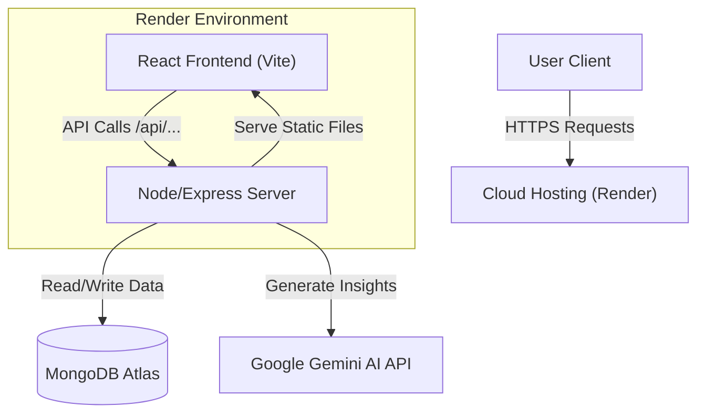
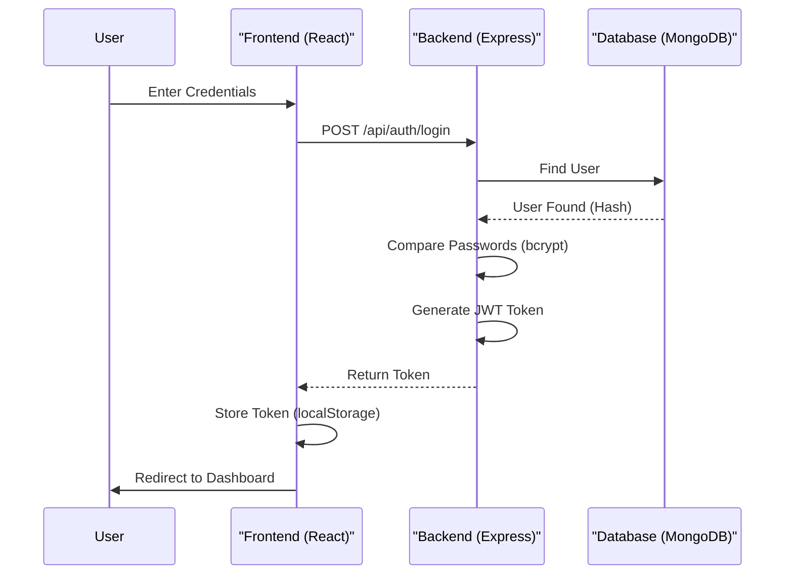
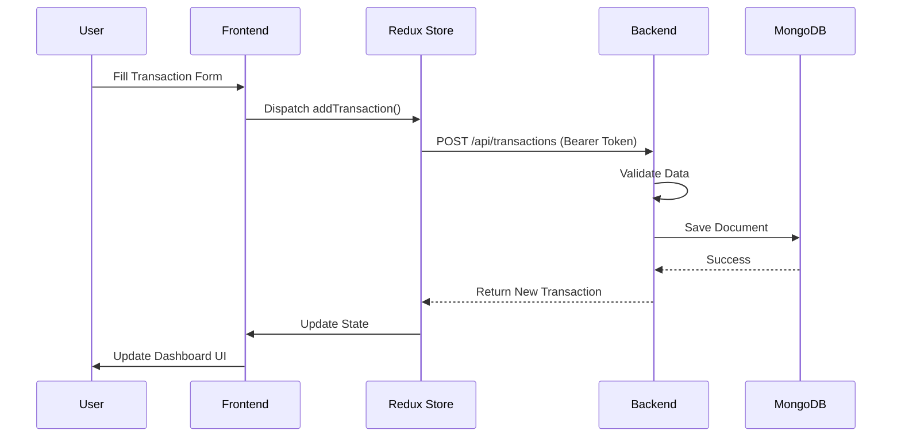
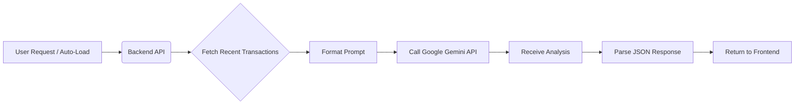

# System Architecture & Flow Diagrams

## 1. High-Level Architecture
The application follows a standard **MERN Stack** architecture (Monolith deployment).



## 2. Authentication Flow (JWT)
Secure login process using JSON Web Tokens.



## 3. Data Flow: Transaction Management
How data moves when a user adds a transaction.



## 4. AI Insight Generation Flow
How the AI feature works.



## Directory Structure
```
/root
  ├── /client (Frontend)
  │     ├── /src
  │     │     ├── /components (UI)
  │     │     ├── /pages (Views)
  │     │     ├── /redux (State)
  ├── /config (DB Connection)
  ├── /controllers (Logic)
  ├── /models (Schemas)
  ├── /routes (API Endpoints)
  ├── /docs (Documentation)
  └── server.js (Entry Point)
```
